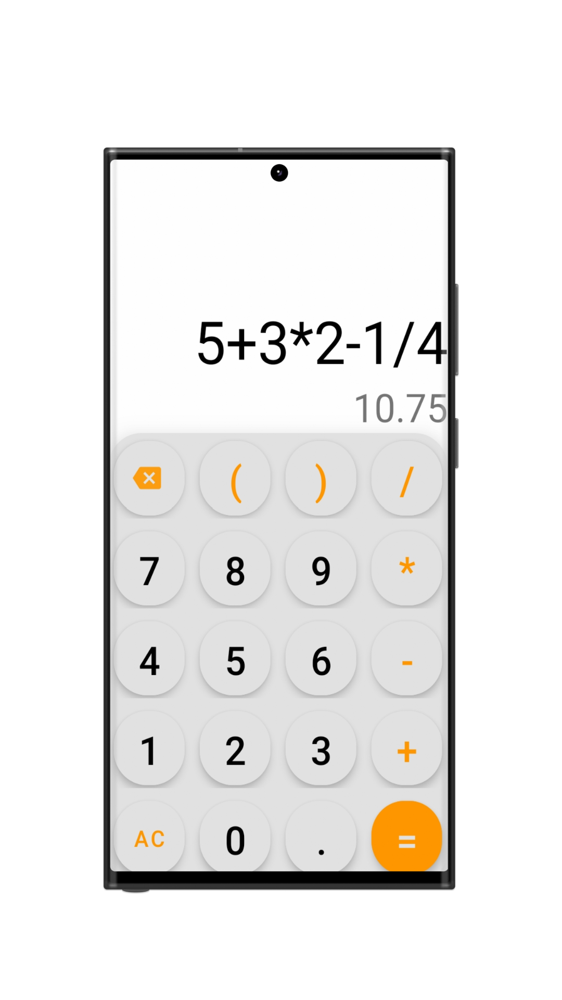
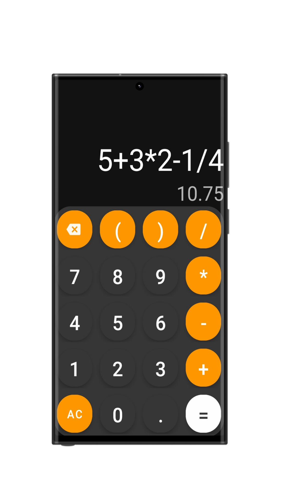

# Calci - A Simple Calculator App

Calci is a simple and user-friendly calculator app built using Java and XML for Android development. It supports basic arithmetic operations and features a sleek design.

## Features

- Basic arithmetic operations: addition, subtraction, multiplication, and division.
- User-friendly interface with a sleek design.
- Available in both light and dark themes.

## Screenshots

### Light Theme


### Dark Theme


## Getting Started

To get a local copy up and running, follow these simple steps.

### Prerequisites

- Android Studio installed on your machine.

### Installation

1. **Clone the repo**
    ```sh
    git clone https://github.com/rakeshreddyadina/calci.git
    ```

2. **Open the project in Android Studio**
    - Open Android Studio.
    - Click on `File > Open`.
    - Navigate to the cloned repository folder and select it.

3. **Build and run the app**
    - Click on the `Run` button in Android Studio.
    - Select your emulator or connected device.

## Usage

- Open the app.
- Enter your arithmetic expression using the on-screen buttons.
- Press the `=` button to see the result.

## Contributing

Contributions are what make the open source community such an amazing place to be learn, inspire, and create. Any contributions you make are **greatly appreciated**.

1. Fork the Project
2. Create your Feature Branch (`git checkout -b feature/AmazingFeature`)
3. Commit your Changes (`git commit -m 'Add some AmazingFeature'`)
4. Push to the Branch (`git push origin feature/AmazingFeature`)
5. Open a Pull Request


